## LWS - Online Learning Portal

#### Technology Used:

- React
- Redux
- Redux toolkit
- TailwindCSS

#### Features implemented:

- authentication for student
- authentication for admin
- create new student
- separate portal for student and admin
- popup - to submit assignment link
- Quiz Mode
- Quiz answer page
- Leaderboard
- Add and Edit video/lesson
- Add and Edit Assignment
- Add and Edit Quiz
- Marking submitted assignments

### Login

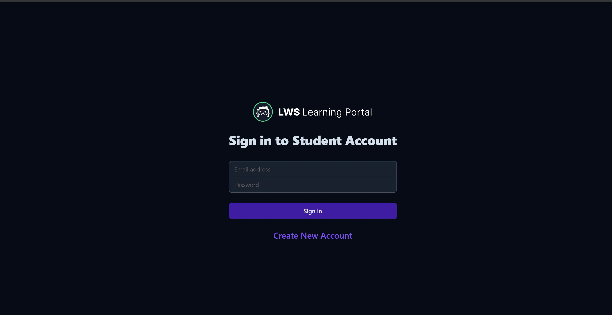

### Create New Student

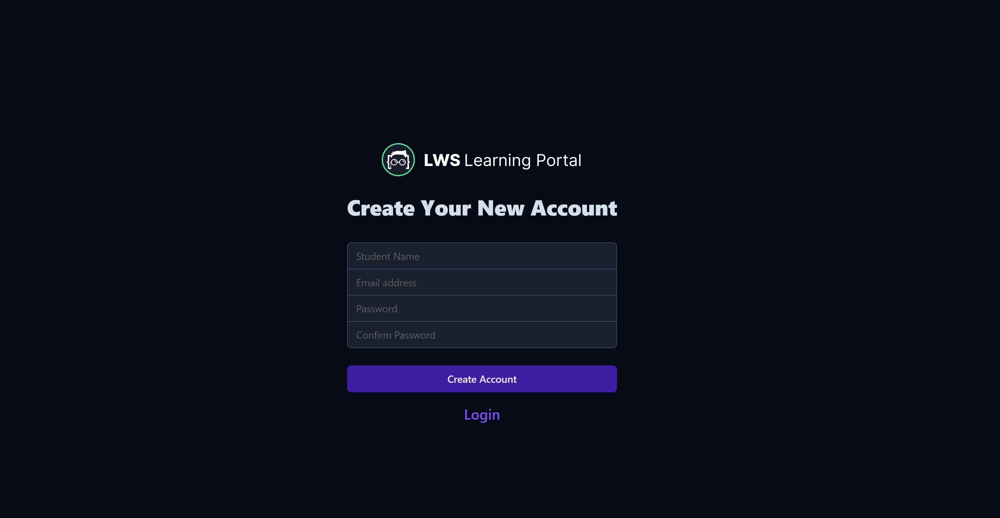

### Student Logged in

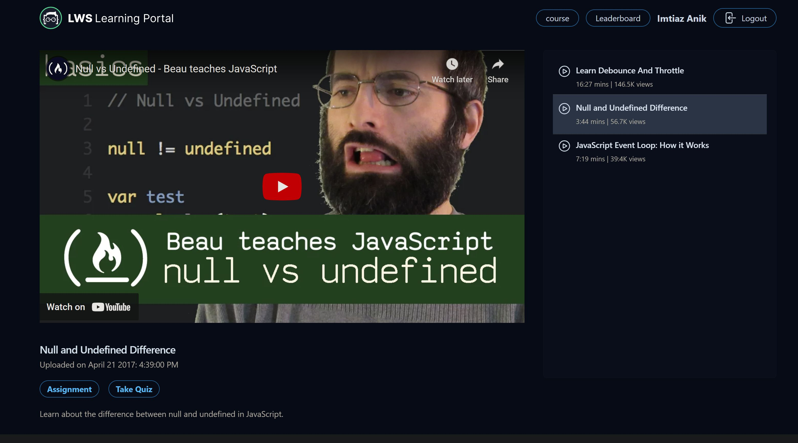

### Assignment Submission popup

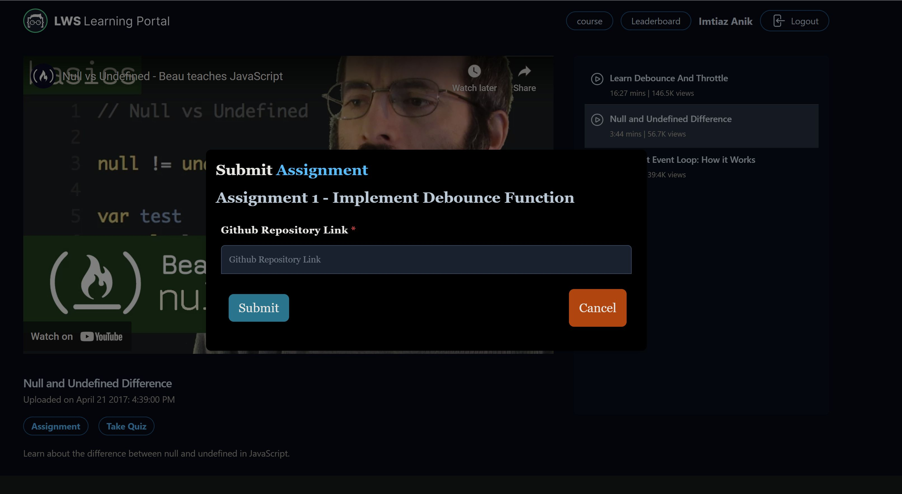

### Assignment and Quiz Submitted

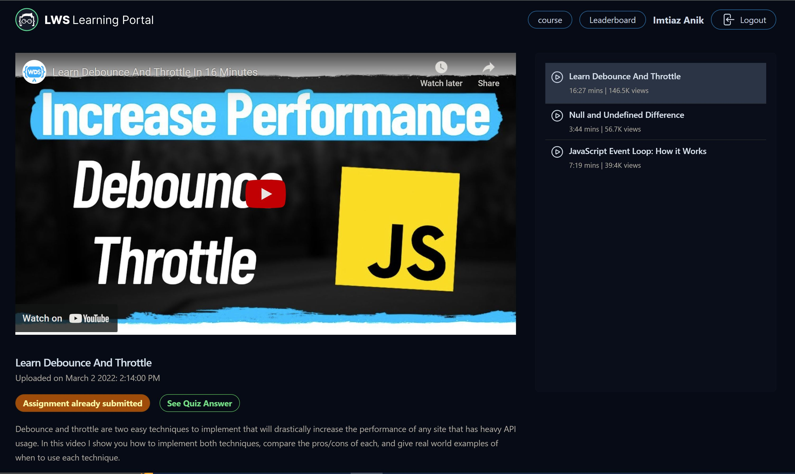

### Quiz Page

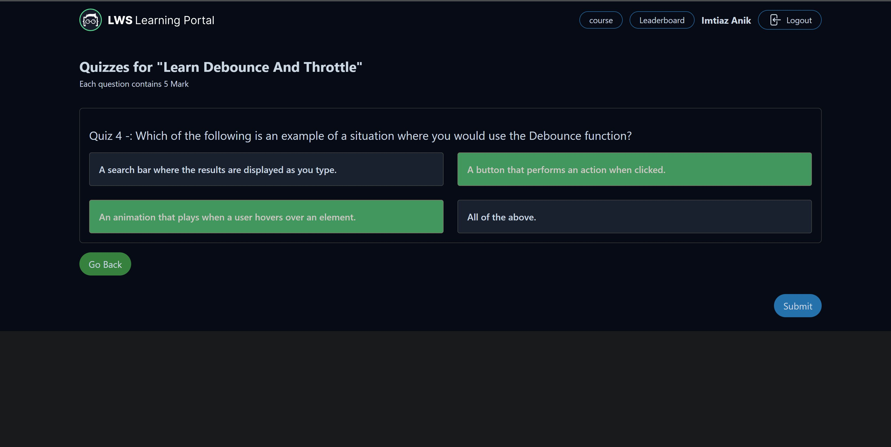

### Quiz Answer

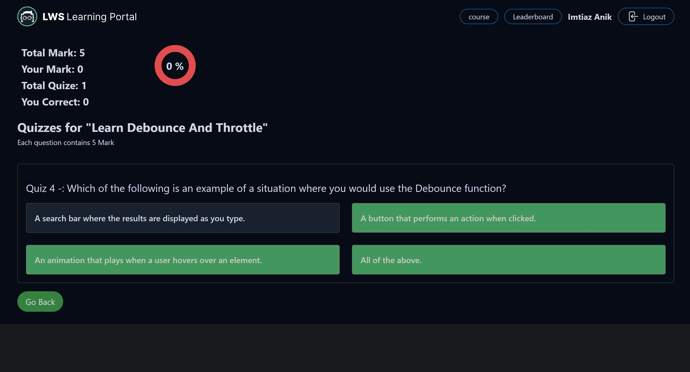

### No Assignment and Quiz

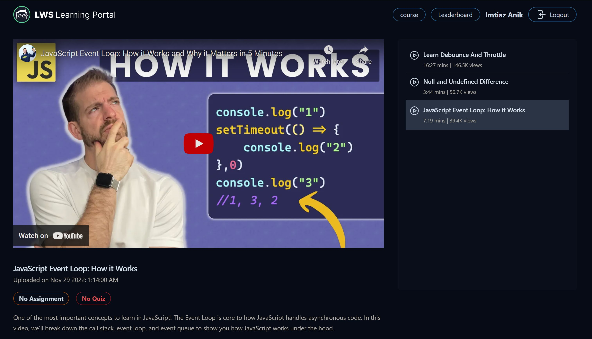

### Leaderboard

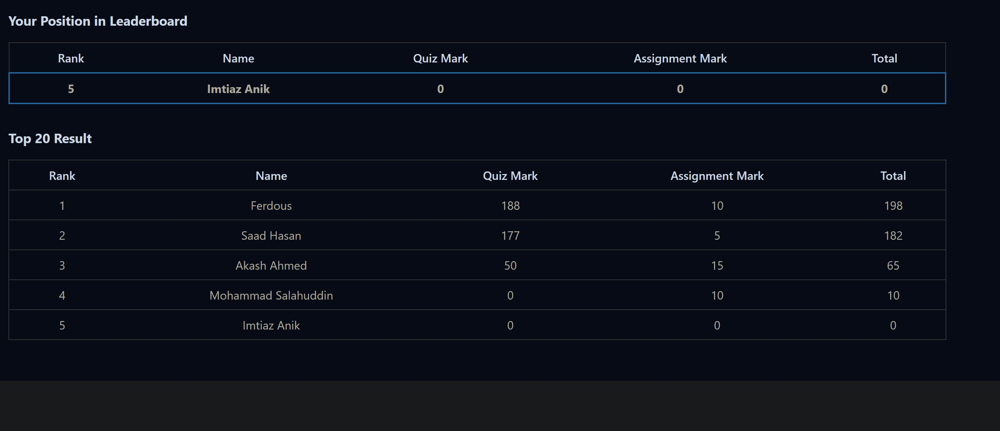

### Admin Login

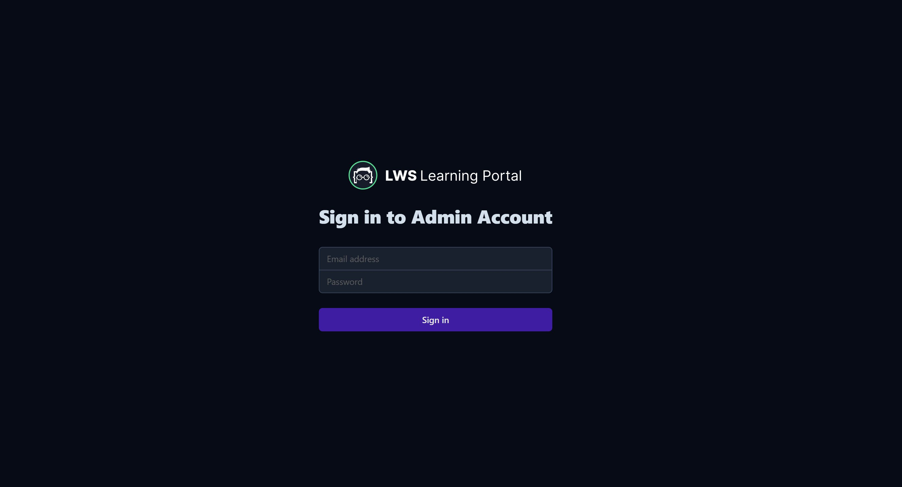

### Admin Homepage

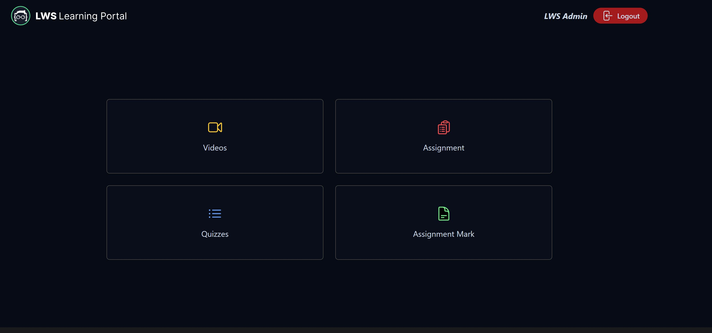

### Admin Video page

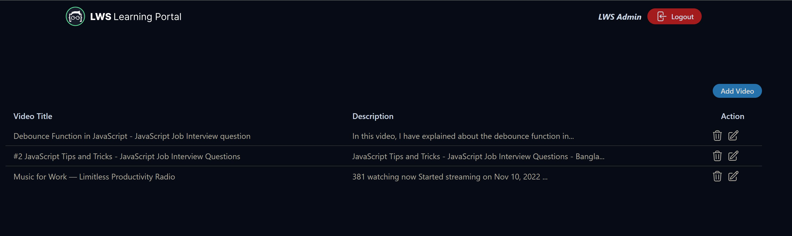

### Admin Add Video page

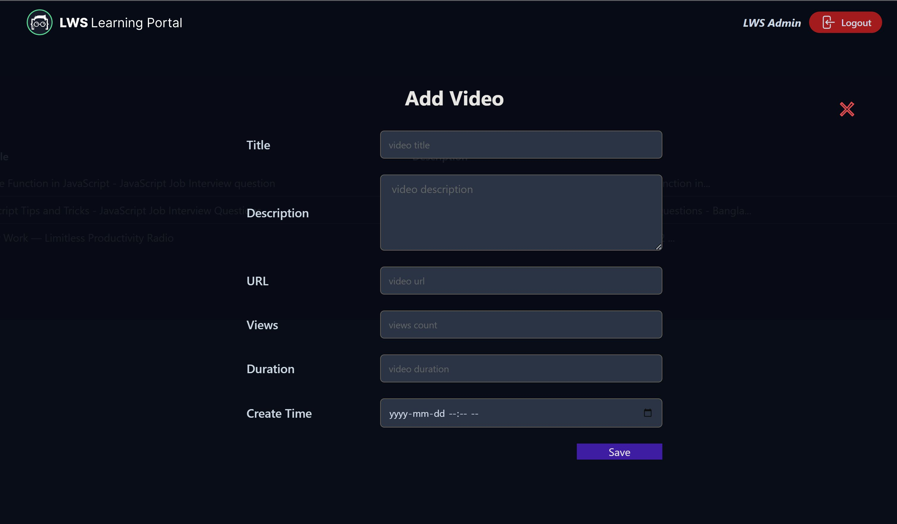

### Admin Assignment page

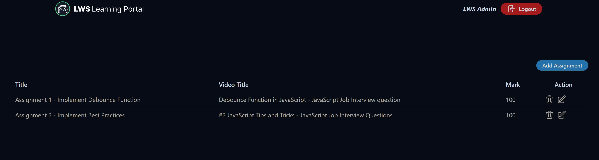

### Admin Add Assignment page

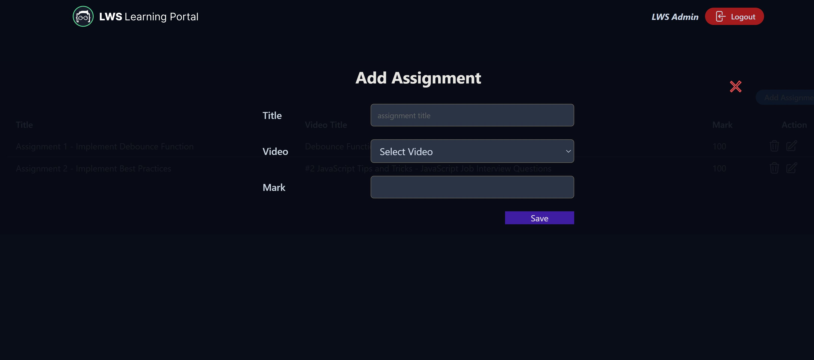

### Admin Quiz page

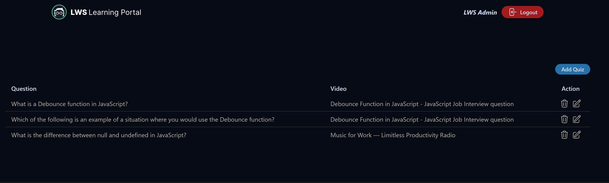

### Admin Add Quiz page

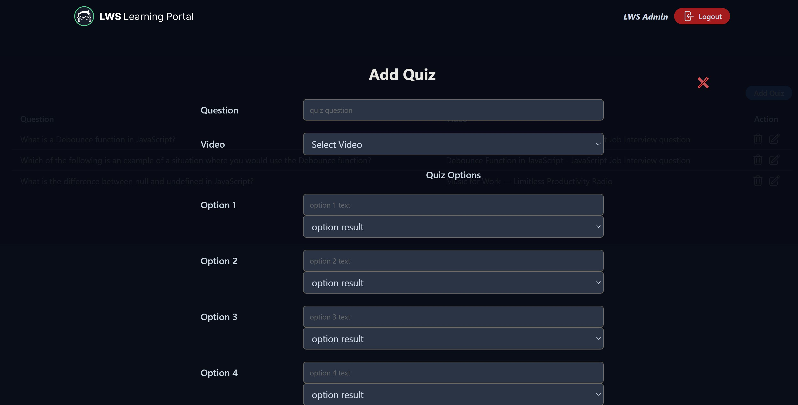

### Admin Modify Quiz page

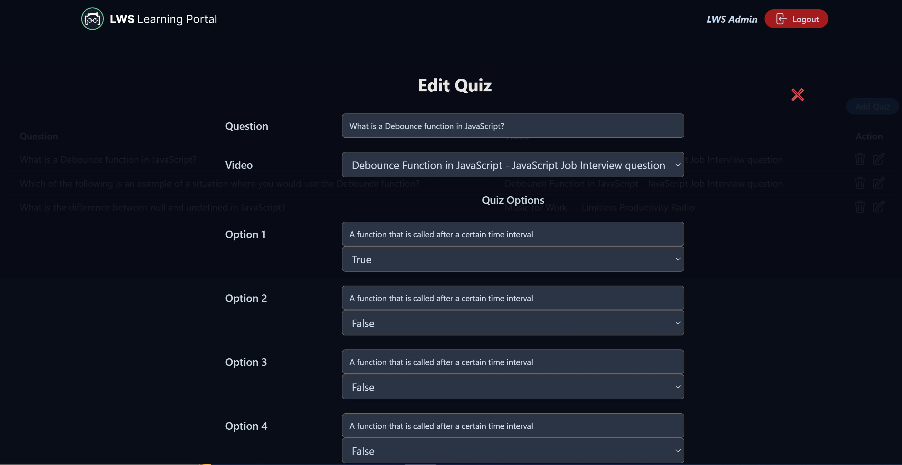

### Admin Assignment Marking page

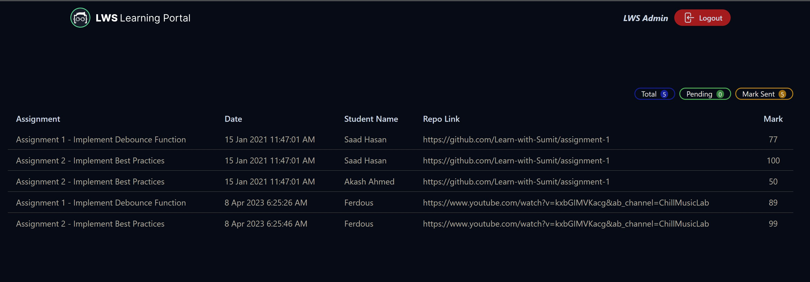
